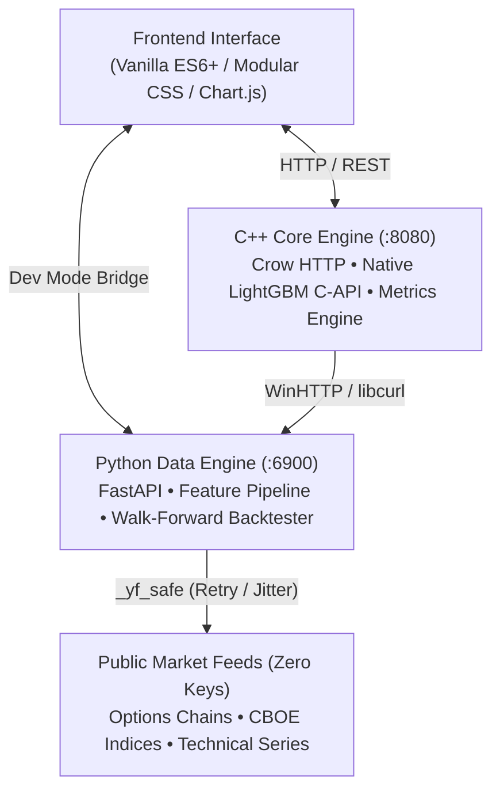

<div align="center">

# PROJECT SCYLLA // Quantitative Options Terminal

**High-Performance Hybrid Quantitative Terminal, Institutional Whale Scanner & ML Backtesting Engine**

[](https://isocpp.org/)
[](https://www.python.org/)
[](https://fastapi.tiangolo.com/)
[](https://lightgbm.readthedocs.io/)
[](https://crowcpp.org/)
[](https://www.microsoft.com/)
[-brightgreen.svg?style=flat-square)](#zero-cost-data-pipeline)
[](LICENSE)

[Architecture](#architecture) • [Features](#core-features) • [Quick Start](#quick-start) • [Strategy Regimes](#strategy-regimes--ml-engine) • [API Reference](#api-reference) • [Validation](#validation--statistical-integrity)

</div>

---

## Executive Overview

**Project Scylla** is a dual-engine options intelligence terminal engineered to detect institutional block flow ("whale orders"), calculate dynamic implied volatility smiles, evaluate historical volatility risk premia, and simulate machine-learning-driven options trading strategies with strict walk-forward temporal isolation.

Built with a high-performance **C++ Crow** core compiling native LightGBM decision trees directly into memory, and coupled with an asynchronous **Python FastAPI** feature-engineering layer, Scylla achieves sub-millisecond inference speeds while maintaining zero external subscription dependencies.

---

## Architecture

Project Scylla employs an asynchronous dual-engine topology separating high-frequency numerical routines and model inference from data extraction and statistical feature generation.



### Dual-Engine Design Rationale
- **C++ Microservice (`cpp_core` on `:8080`)**: Executes C-API LightGBM decision tree evaluations in microseconds, computes options pricing metrics, and orchestrates live streaming endpoints with minimal memory footprint.
- **Python Data Engine (`backend` on `:6900`)**: Orchestrates asynchronous options chain retrieval, engineers complex multi-horizon feature vectors (Historical Volatility, Skew, Put/Call ratios, SMA momentum), runs hyperparameter sweeps, and manages SQLite transaction persistence.
- **Dynamic Port Bridge**: The launcher script automatically detects running instances, clears occupied ports, and hot-patches the frontend API configuration between direct Python dev mode and high-throughput C++ production routing.

---

## Core Features

### Institutional Whale Scanner
- Real-time anomaly detection identifying options volume surging beyond $\ge 5\times$ Open Interest.
- Automatic classification of aggressive directional order flow, premium size tiering, and contract expiration concentration.
- Cross-references whale activity against underlying technical moving averages (50-day / 200-day SMA).

### Embedded LightGBM Inference Engine
- Native C++ LightGBM C-API integration for sub-millisecond classification.
- Predicts directional trade regimes: `VOL_EXPANSION`, `SIDEWAYS`, `BULLISH_BREAKOUT`, and `BEARISH_BREAKDOWN`.
- Automatic transparent fallback to Python LightGBM if C++ runtime is offline.

### Volatility Surface & IV Skew Sandbox
- Dynamic IV Rank and IV Percentile tracking across monitored equities and benchmark indices.
- Strike-by-strike implied volatility smile curves across out-of-the-money puts and calls.
- 30-day historical Put/Call ratio tracking for market sentiment proxies (`SPY`, `QQQ`, `IWM`).
- At-the-money straddle expected move calculator ($\pm \$$ expected market dispersion).

### Walk-Forward Quantitative Backtester
- Robust out-of-sample walk-forward simulation engine with strict chronological temporal separation to eliminate lookahead bias.
- Full performance telemetry: **Sharpe Ratio**, **Sortino Ratio**, **Calmar Ratio**, **Max Drawdown**, **Win Rate**, and **Kelly Fraction Sizing**.
- Hyperparameter grid sweeps producing Pareto-optimal profit-taking and stop-loss boundaries.

### Zero-Cost Resilient Data Pipeline
- Zero paid API keys or recurring data fees required.
- Custom `_yf_safe` networking layer featuring exponential backoff, jittered retry scheduling, and circuit breaker patterns to guarantee continuous uptime over public market feeds.

---

## Strategy Regimes & ML Engine

Scylla provides three distinct portfolio strategy archetypes optimized via multi-parameter grid search:

| Strategy | Target Regime | Mechanics & Filtering |
|---|---|---|
| **Whale Quality** (`whale_quality`) | Institutional Momentum | Isolates large-block options activity where Volume/OI $\ge 5.0$, filtered by 50d/200d trend alignment and high ML model confidence. |
| **Contrarian Trend** (`contrarian_trend`) | Mean Reversion | Captures extreme IV skew imbalances and overextended RSI/SMA deviations for mean-reverting premium capture. |
| **Volatility Regime** (`vol_regime`) | Volatility Spread Arbitrage | Dynamically scales position sizing based on the spread between Implied Volatility (IV) and 30-day Realized Historical Volatility (HV), indexed against VIX tiers. |

### Quant Performance Derivations
- **Kelly Sizing**: Optimal capital allocation derived via:
  $$f^* = \frac{p \cdot b - q}{b}$$
  *(where $p$ is model win probability, $q = 1 - p$, and $b$ is payoff ratio, with customizable fractional Kelly dampeners).*
- **Expected Value (EV)**:
  $$\text{EV} = (P_{\text{win}} \times \text{Avg Win}) - ((1 - P_{\text{win}}) \times \text{Avg Loss})$$

---

## Tech Stack

| Layer | Technologies | Purpose |
|---|---|---|
| **Frontend** | Vanilla ES6+, CSS3 Modules, Chart.js, HTML5 | Zero-overhead responsive terminal UI and interactive visualizations |
| **High-Speed Core** | C++20, Crow Microframework, MSVC x64, CMake | Native HTTP server, sub-millisecond inference, numerical metrics |
| **ML Engine** | LightGBM (C-API & Python), Scikit-Learn | Binary & multiclass trade regime classification |
| **Data & Backtesting** | Python 3.11+, FastAPI, Uvicorn, Pandas, NumPy, SciPy | Asynchronous options ingestion, feature engineering, walk-forward simulation |
| **Storage & Cache** | SQLite3, In-Memory Caching | Trade persistence, parameter defaults, and signal histories |
| **Networking** | WinHTTP, libcurl, HTTPX, yfinance | Asynchronous HTTP transport and resilient market data extraction |

---

## Quick Start

### Prerequisites
- **Operating System**: Windows 10/11 (x64)
- **Python**: [Python 3.11+](https://www.python.org/) (ensure *"Add Python to PATH"* is checked)
- **C++ Toolchain** *(for full production build)*:
  - Visual Studio 2022 / 2026 (or Visual Studio Build Tools with *Desktop development with C++*)
  - [CMake 3.20+](https://cmake.org/download/)

---

### Option A: One-Click Launch (Recommended)
Run the automated launcher. It will configure the virtual environment, install dependencies, manage ports, build native components if needed, and open the terminal in your browser:

```powershell
.\LAUNCH_SCYLLA.ps1
```
*(Or double-click `LAUNCH_SCYLLA.bat`)*

---

### Option B: Developer Mode (Fast Boot)
Bypasses C++ compilation and launches the full-featured Python FastAPI backend + frontend immediately:

```powershell
.\scripts\start_dev.ps1
```

---

### Option C: Production Native Build
Fetches vendored C++ dependencies (Crow, Asio, LightGBM, nlohmann/json, libcurl), compiles the Release x64 binary via CMake/MSVC, and starts the dual-engine cluster:

```powershell
.\scripts\deploy.ps1
```

## Features
- **Whale Scanner** — EOD unusual options vol/OI ≥5x glow neon blue
- **Put/Call Ratio Tracker** — SPY/QQQ/IWM 30-day trend
- **Volume Concentration** — Stacked bar by expiration cycle
- **IV Sandbox & Skew** — IV Rank, Percentile, Volatility Smile
- **Swing Alignment** — 50d/200d SMA trend flags on whale tickers
- **Expected Move** — ATM straddle ±$ range calculator

**No paid API keys required.** All data via free yfinance + OpenBB ODP.
